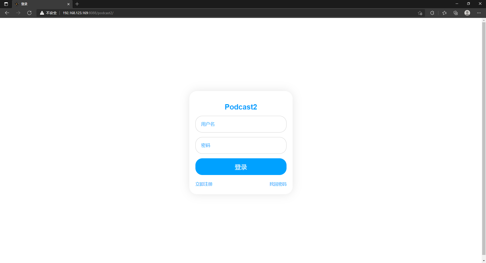
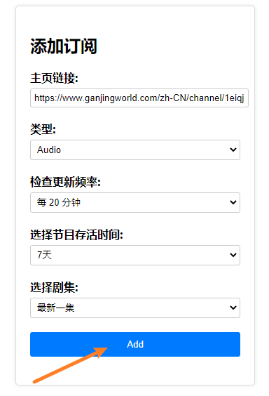
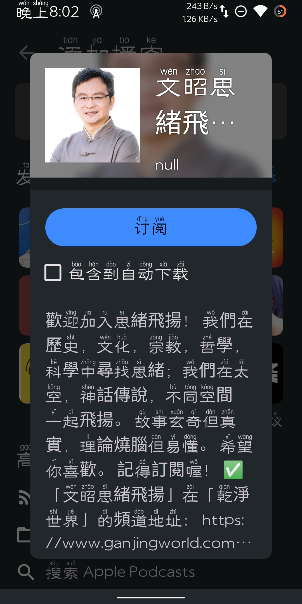

# 快速开始
## 使用Docker-cli部署Podcast2

#### 1.安装并启动Docker

````shell
curl -fsSL https://get.docker.com -o get-docker.sh && sh get-docker.sh && systemctl start docker
````

#### 2.创建并启动容器

````shell
mkdir  ~/podcast2
cd ~/podcast2
docker run -id --name=podcast2 \
-p 8088:8088 \
-p 6800:6800 \
-v ~/podcast2/xml:/opt/tomcat/tomcat8/webapps/podcast2/xml/ \
-v ~/podcast2/video:/opt/tomcat/tomcat8/webapps/podcast2/video/ \
-v ~/podcast2/audio:/opt/tomcat/tomcat8/webapps/podcast2/audio/ \
-v ~/podcast2/plugin:/opt/tomcat/tomcat8/webapps/podcast2/plugin/ \
-v ~/podcast2/logs:/logs \
yajuhua/podcast2:1.2.8
````

#### 3.防火墙放行8088端口

````shell
#以下是centos7，其他系统自行搜索。
firewall-cmd --add-port=8088/tcp --permanent
firewall-cmd --reload
````

#### 4.进入面板

> 默认访问地址 [http://你的IP地址:8088/podcast2]()
>
> 默认用户名：admin <br>
> 默认密码：1



## 添加插件

> 项目默认是没有添加插件的，自行按需添加

#### 1.下载插件

| 网站             | 名称 | 版本 | 下载地址                                     |
| :------------------------------- | -------------------- | -------------------- | ------------------------------------------------------------ |
| [干净世界](https://ganjing.com/) | ganjing              | 1.2.1                | [点击下载](https://raw.githubusercontent.com/yajuhua/plugin/master/ganjing/Ganjing3-1.2.1-jar-with-dependencies.jar) |
| [ntdm](https://www.ntdm.tv)              | ntdm8                | 1.2.1                | [点击下载](blob:https://github.com/e2ad0b0e-d240-4a17-a04a-dd6ada162b46) |

#### 2.进入管理页面


#### 3.点击选取插件


#### 4.点击上传到服务器


## 添加订阅

> 以干净世界为例

#### 1.复制主页链接


#### 2.粘贴并点击Add



#### 3.添加成功后会跳转到订阅列表


#### 4.扫描二维码添加到播客APP（如：AntennaPod）



## 播客APP

<a href="https://www.apple.com/apple-podcasts/" target="_blank">
              
            </a><a href="https://podcastaddict.com/" target="_blank"></a>  <a href="https://antennapod.org/" target="_blank">
                        </a>
