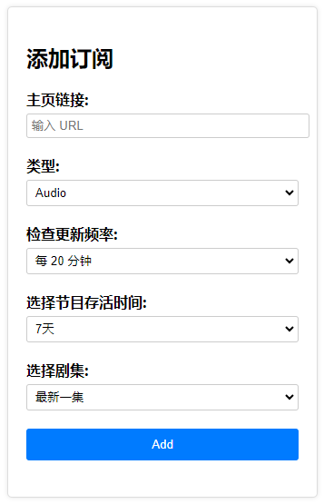
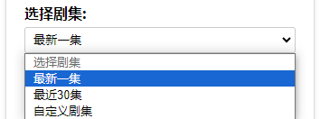

# 订阅配置说明
> 用户可自定义配置订阅的设置，如果你觉得麻烦，默认即可。

 

# 类型选择

目前支持视频和音频两种类型，默认是音频

 

# 检查更新频率

系统会根据用户选择的检查更新频率进行轮询，以获取最新的节目信息。

 

# 节目存活时间

为了避免消耗过多的存储空间，用户可选择单集节目的存活时间，默认是7天。

 

# 选择剧集

用户可自定义选择从哪一集开始订阅

自定义剧集格式：集数,集数

比如要收听3到5集，就可以写成3,4,5

