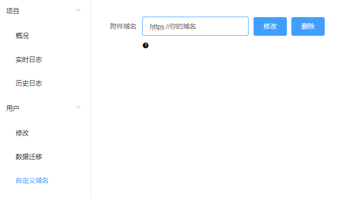

# 高级应用
如果想更进一步，可以看看这里。
## API 接口调用
使用api接口来控制podcast2，需要podcast2版本2.5.0+
> 调用 API 接口需要掌握以下前置知识：
>
> 1. **API 概念**：了解 API 的基本概念。
> 2. **HTTP 协议**：熟悉常用的 HTTP 请求方法（GET、POST 等）和状态码。
> 3. **数据格式**：理解 JSON 和 XML，常用于请求和响应。
> 4. **API 文档**：能够阅读并理解 API 文档，知道请求参数和返回格式。
> 5. **Swagger**：测试和调试 API 调用。

### 开启API文档

### 生成apiToken
所有 API 调用都需在header中加入apiToken

### 请求示例


## Telegram bot
> **实验性功能**：此功能正在开发中，旨在更方便追加节目。请注意，功能可能不稳定。

### demo
<video width="640" height="360" controls>
  <source src="../videos/telegram-bot-demo.mp4" type="video/mp4">
  Your browser does not support the video tag.
</video>

## 添加订阅
> 如果默认配置无法满足，可以看看下面。
### 同步方式
为了应对博主在短时间内更新多期节目的情况，我们提供了 **同步方式** 选项，允许用户根据自己的需求选择如何同步节目。

- **最新**（默认）：只下载最新发布的一期节目。适合关注单期节目更新的用户。

- **最近**：下载最近一段时间内更新的多期节目，确保不会漏掉博主短时间内更新的内容。适合那些希望及时获取所有新内容的用户。

用户可以根据自己的偏好选择适合的同步方式，以确保不会错过任何重要的节目。

### 追加节目

<p>除了通过频道订阅获取博主的最新内容外，我们还提供了 追加节目 功能。</p>

<p>通过该功能，用户可以在发现有趣的视频时，直接将该视频添加到自己的订阅列表中，而不需要整个频道的订阅。</p>

### 创建空订阅
可以创建一个空白的订阅列表，然后通过 **追加节目** 功能，将自己喜欢的节目逐步加入到订阅中。这样，你可以根据兴趣打造完全个性化的订阅列表。

### 自定义剧集
自定义的是视频列表，如1-5,7会下载列表中序号1到5和7的视频。
**注意** 需要在英文状态下输入

### 最近30集
最多下载最近30集节目，但不一定有30集。

## Caddy 开启 HTTPS
> 需要掌握Caddy的基本用法
>
### Caddyfile
```text
  你的域名 {
	reverse_proxy localhost:8088
} 
```
### podcast2自定义附件域名



