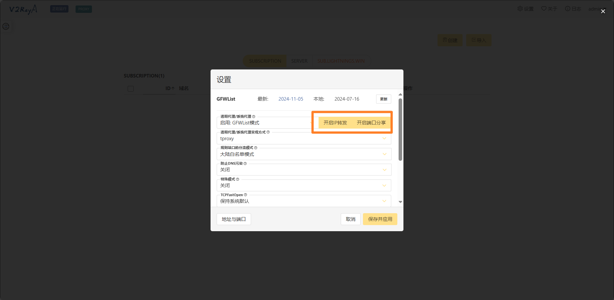
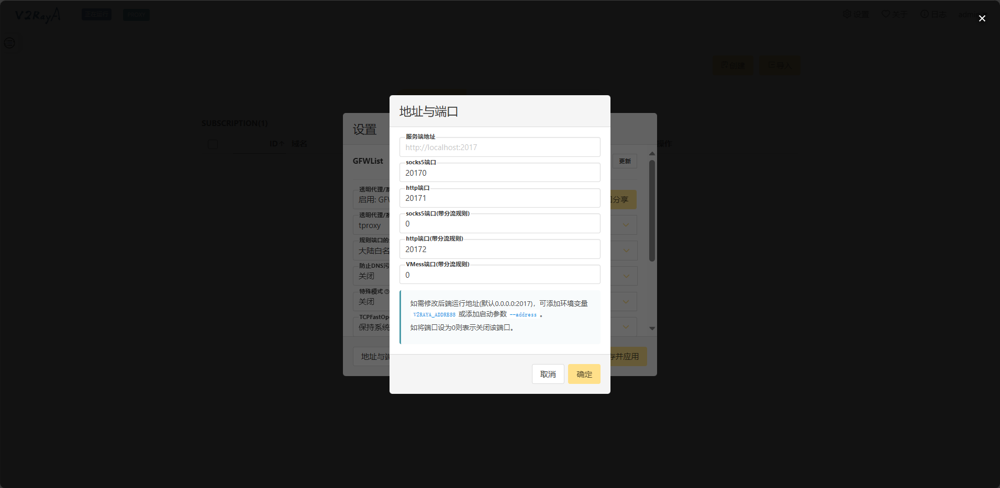
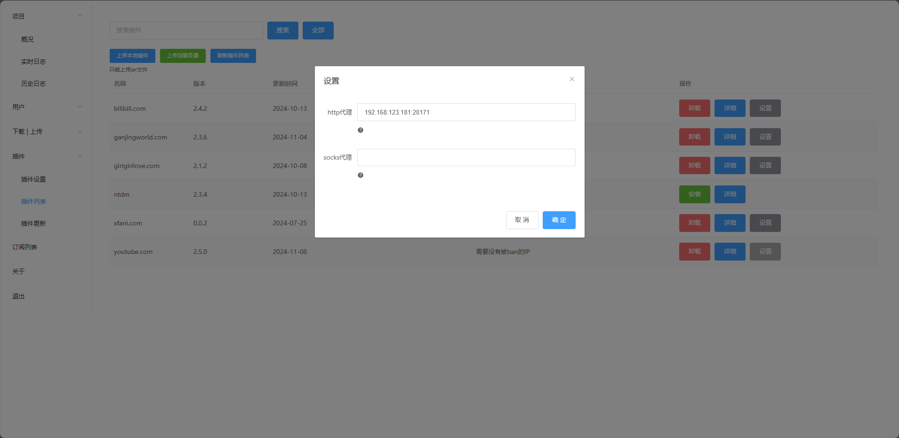

## YouTube
### 使用cloudflare workers代理
yt-dlp可能会出现[Sign in to confirm you’re not a bot. This helps protect our community](https://github.com/yt-dlp/yt-dlp/issues/10128)导致无法下载的情况。
目前的解决方案是使用cloudflare的IP，因为没有被YouTube拉黑。当然，如果你的没有被拉黑，可以跳过。
> 需要具备以下条件
>
> 1. **cloudflare账号**：一个邮箱就可以注册了
> 2. **会创建cloudflare workers**
> 3. **会安装和操作v2raya**

#### 使用cloudflare workers创建vless节点
- 参考[cmliu/edgetunnel](https://github.com/cmliu/edgetunnel)
- 参考[zizifn/edgetunnel](https://github.com/zizifn/edgetunnel)
- 注意 workers.dev域名在国内是无法访问的

#### v2raya开启局域网共享

#### 设置插件代理

