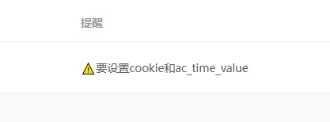

## 通用
### 插件提醒
它一直都在的 

## YouTube
### 支持链接
- https://www.youtube.com/@laogao/videos
- https://www.youtube.com/@laogao/streams

### 剧集选择
只能下载最新的

### 更新频率
建议不要太频繁
### 解决Sign in to confirm you’re not a bot
yt-dlp可能会出现[Sign in to confirm you’re not a bot. This helps protect our community](https://github.com/yt-dlp/yt-dlp/issues/10128)导致无法下载的情况。
目前的解决方案是使用cloudflare的IP，因为没有被YouTube拉黑。当然，如果你的没有被拉黑，可以跳过。
> 需要具备以下条件
>
> 1. **cloudflare账号**：一个邮箱就可以注册了
> 2. **会创建cloudflare workers**
> 3. **会安装和操作v2raya**

#### 使用cloudflare workers创建vless节点
- 参考[cmliu/edgetunnel](https://github.com/cmliu/edgetunnel)
- 参考[zizifn/edgetunnel](https://github.com/zizifn/edgetunnel)
- 注意 workers.dev域名在国内是无法访问的

#### v2raya开启局域网共享

#### 设置插件代理

## 哔哩哔哩
目前风控太严，只能选择授权的方式，参考 [Web端Cookie刷新](https://socialsisteryi.github.io/bilibili-API-collect/docs/login/cookie_refresh.html)。
### 浏览器获取cookie和ac_time_value
#### 打开浏览器登录哔哩哔哩

#### 复制cookie

#### 复制ac_time_value

#### 注意

这样子相当于登录了，复制后要清理哔哩哔哩浏览器记录，否则会与本插件冲突。

### 在线获取cookie和ac_time_value
[https://b-login.vercel.app/](https://b-login.vercel.app/)

---

